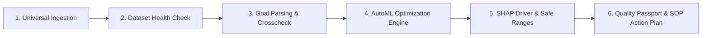

# Modliq Product Overview

> **Last verified:** 2026-08-09  
> **Source of truth:** Current Codebase & Platform Specification  
> **Status:** Implemented / Launch-Ready  

---

## 📌 Executive Summary

**Modliq is a no-code manufacturing intelligence and machine learning platform by Qeltrava AI, built in Tamil Nadu, India.**

> **Core Positioning:**  
> **Analyze what happened. Optimize what happens next. Prove it with a Quality Passport.**

Modliq enables factory teams to analyze past production data, optimize future process setpoints using no-code machine learning, and prove decisions to OEM buyers with audit-ready Quality Passports — without needing a data analyst, data scientist, or ML engineer to get started.

---

## 🎯 Unified Role Workflows

Modliq brings together the repetitive workflows traditionally handled by separate data and engineering roles into a single guided platform:

- 📊 **Data Analyst Workflows** — EDA, dataset health diagnostic checks, KPI auto-mapping, trend analysis, OEE summaries, supplier risk, and insight narratives.
- 🤖 **ML Engineer Workflows** — No-code natural language goal parsing, feature validation, AutoML benchmarking leaderboard, constrained optimization, setpoint recommendation, drift monitoring, and retraining advisory.
- 📐 **Quality Engineer Workflows** — Quality Studio, SPC I-MR control charts, $C_p$ / $C_{pk}$ capability math, AQL sampling, CAPA suggestions, and control plan support.
- 🏭 **Operations Workflows** — OEE calculators, downtime Pareto analysis, bottleneck insights, and shift/machine/line comparisons.
- 🔗 **Supply Chain Workflows** — Supplier scorecards, material lot yield traceability, yield by supplier, and incoming quality risk badges.
- ⚡ **Lean / Kaizen Workflows** — Waste tracking, 5S audits, Takt/Kanban calculators, and continuous improvement action boards.

> **Human Engineering Control:** The platform keeps manufacturing teams in full control while eliminating technical friction, manual spreadsheets, and custom coding.

---

## 🔄 Core Platform Workflow

1. **Universal Ingestion**: Support CSV, Excel, PDF/Word documents, and database connectors (PostgreSQL, Supabase, MongoDB, MySQL, SQL Server).
2. **Dataset Health Check**: Automatic profiling of rows, missing values, correlation matrices, high-cardinality flags, and overall dataset health scoring (0–100).
3. **Goal Parser & Crosscheck**: Natural language goal parsing extracted into structured targets and variable constraints with interactive user safety verification.
4. **AutoML Optimization Engine**: 16-algorithm model zoo execution (Random Forest, Gradient Boosting, Extra Trees, Ridge, Lasso, ElasticNet, etc.) with hyperparameter tuning.
5. **SHAP Driver & Safe Parameter Ranges**: Plain-English key process drivers, feature importance ranking, and optimal operating windows.
6. **Quality Passport & SOP Action Plan**: One-click generation of audit-ready Quality Passports with Markdown export, public share links, and actionable Kaizen step recommendations.

---

## 🇮🇳 Tamil Nadu & Qeltrava AI Positioning

Modliq is conceived, architected, and built in **Tamil Nadu, India**—one of Asia's premier manufacturing and industrial engineering hubs. As part of **Qeltrava AI**, Modliq combines deep regional domain expertise in specialty chemicals, automotive components, textile manufacturing, precision plastics, food & pharma, and electronics assembly with cutting-edge artificial intelligence.

---

## 🔗 Related Documentation

- [PLATFORM_FEATURES.md](file:///c:/Users/sathish/Desktop/Modliq/Modliq/docs/00-overview/PLATFORM_FEATURES.md) — Comprehensive 45-module feature catalog
- [LAUNCH_STATUS.md](file:///c:/Users/sathish/Desktop/Modliq/Modliq/docs/00-overview/LAUNCH_STATUS.md) — Public launch readiness score
- [SYSTEM_ARCHITECTURE.md](file:///c:/Users/sathish/Desktop/Modliq/Modliq/docs/01-architecture/SYSTEM_ARCHITECTURE.md) — System topology & architecture
