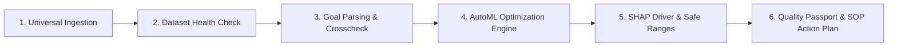

# MODLIQER Product Overview

> **Last verified:** 17/08/2026
> **Source of truth:** Current Codebase & Platform Specification  
> **Status:** Implemented / Launch-Ready  

---

## 📌 Executive Summary

**MODLIQER is a no-code machine learning and analytics platform for manufacturing teams, educators, students, and research scholars by Qeltrava AI, built in Tamil Nadu, India.**

> **Primary Positioning (August 20 Launch):**  
> **Analyze data. Build models. Prove results — without code.**
>
> - **Manufacturing Lane:** *Analyze what happened. Optimize what happens next. Prove it with a Quality Passport.*
> - **Education & Research Lane:** *Learn data analysis and machine learning by doing — without writing code.*

MODLIQER enables manufacturing teams to analyze production data, optimize process settings, validate quality (SPC, Cp/Cpk), and generate buyer-ready PPAP/ISIR Quality Passports. For education and research, it provides a no-code environment to teach, learn, and apply EDA, visualization, AutoML, model comparison, and report generation — without writing Python or SQL code.

> **Human Control Guardrail:** MODLIQER supports learning and decision-making, reduces technical friction, automates repetitive workflows, and keeps humans in control. It does not replace teachers, researchers, engineers, or data scientists.

---

## 🎯 Unified Role Workflows

MODLIQER brings together the repetitive workflows traditionally handled by separate data and engineering roles into a single guided platform:

- 📊 **Data Analyst Workflows** — EDA, dataset health diagnostic checks, KPI auto-mapping, trend analysis, OEE summaries, supplier risk, and insight narratives.
- 🤖 **ML Engineer Workflows** — No-code natural language goal parsing, feature validation, AutoML benchmarking leaderboard, constrained optimization, setpoint recommendation, drift monitoring, and retraining advisory.
- 📐 **Quality Engineer Workflows** — Quality Studio, SPC I-MR control charts, $C_p$ / $C_{pk}$ capability math, AQL sampling, CAPA suggestions, and control plan support.
- 🏭 **Operations Workflows** — OEE calculators, downtime Pareto analysis, bottleneck insights, and shift/machine/line comparisons.
- 🔗 **Supply Chain Workflows** — Supplier scorecards, material lot yield traceability, yield by supplier, and incoming quality risk badges.
- ⚡ **Lean / Kaizen Workflows** — Waste tracking, 5S audits, Takt/Kanban calculators, and continuous improvement action boards.

> **Human Engineering Control:** The platform keeps manufacturing teams in full control while eliminating technical friction, manual spreadsheets, and custom coding.

---

## 🔄 Core Platform Workflow

1. **Universal Ingestion**: Support CSV, Excel, PDF/Word documents, and database connectors (PostgreSQL, Supabase, MongoDB, MySQL, SQL Server).
2. **Dataset Health Check**: Automatic profiling of rows, missing values, correlation matrices, high-cardinality flags, and overall dataset health scoring (0–100).
3. **Goal Parser & Crosscheck**: Natural language goal parsing extracted into structured targets and variable constraints with interactive user safety verification.
4. **AutoML Optimization Engine**: 16-algorithm model zoo execution (Random Forest, Gradient Boosting, Extra Trees, Ridge, Lasso, ElasticNet, etc.) with hyperparameter tuning.
5. **SHAP Driver & Safe Parameter Ranges**: Plain-English key process drivers, feature importance ranking, and optimal operating windows.
6. **Quality Passport & SOP Action Plan**: One-click generation of audit-ready Quality Passports with Markdown export, public share links, and actionable Kaizen step recommendations.

---

## 🇮🇳 Tamil Nadu & Qeltrava AI Positioning

MODLIQER is conceived, architected, and built in **Tamil Nadu, India**—one of Asia's premier manufacturing and industrial engineering hubs. As part of **Qeltrava AI**, MODLIQER combines deep regional domain expertise in specialty chemicals, automotive components, textile manufacturing, precision plastics, food & pharma, and electronics assembly with cutting-edge artificial intelligence.

---

## 🧪 MODLIQER AI Labs (Beta) Experimental Showcase

In addition to core manufacturing intelligence and AutoML, MODLIQER includes the **MODLIQER AI Labs (Beta)** suite (controlled by feature flag `AI_LABS_ENABLED=true`):

- **DocuMind RAG:** PDF document intelligence with Qdrant vector retrieval and real page citations.
- **Agent Task Pilot:** Bounded agentic workflow powered by LangGraph state machine with human-in-the-loop approval gates.
- **Voice AI Coach:** Real-time voice practice session engine with STT/TTS and text fallback.
- **Browser AutoQA:** Plain-English Playwright web automation testing with strict domain allowlisting (`localhost`, `modliq-io.vercel.app`).
- **SpendLens SaaS:** OCR receipt intelligence, automated verification gate, and spending analytics.

---

## 🔗 Related Documentation

- [PLATFORM_FEATURES.md](file:///c:/Users/sathish/Desktop/Modliq/Modliq/docs/00-overview/PLATFORM_FEATURES.md) — Comprehensive 45-module feature catalog
- [LAUNCH_STATUS.md](file:///c:/Users/sathish/Desktop/Modliq/Modliq/docs/00-overview/LAUNCH_STATUS.md) — Public launch readiness score
- [SYSTEM_ARCHITECTURE.md](file:///c:/Users/sathish/Desktop/Modliq/Modliq/docs/01-architecture/SYSTEM_ARCHITECTURE.md) — System topology & architecture
- [AI_LABS.md](file:///c:/Users/sathish/Desktop/Modliq/Modliq/docs/06-ai/AI_LABS.md) — AI Labs architecture & specifications
