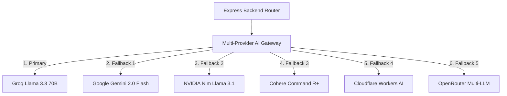

# Modliq Multi-Provider AI Architecture

> **Last verified:** 2026-08-04  
> **Source of truth:** Current codebase inspection  
> **Status:** Implemented / Launch-Ready  

---

## 🤖 Multi-Provider AI Gateway Topology

Modliq's AI layer is engineered with zero lock-in to any single vendor. It features a resilient multi-provider AI Gateway implemented in `backend/src/ai/aiGateway.ts`.

---

## ⚙️ Key Architectural Principles

1. **No Direct Frontend AI Calls**: The browser client **never** calls AI providers directly. All prompts pass through `backend/src/routes/ai.routes.ts`.
2. **Automatic Provider Fallback**: If the primary AI provider returns an HTTP 429, timeout, or rate-limit error, the gateway seamlessly fails over to the next configured provider in sequence.
3. **Emergency AI Kill Switch**: Controlled via the `AI_FEATURES_ENABLED=true/false` environment variable. When set to `false`, all AI endpoints return a safe, pre-compiled static response without attempting external network calls.
4. **Prompt Safety & Guardrails**: System prompts strictly instruct LLMs to avoid hallucinations, keep responses grounded in provided numerical datasets, and output JSON schemas when requested.

---

## 🔗 Related Documentation

- [AI_GATEWAY.md](file:///c:/Users/sathish/Desktop/Modliq/Modliq/docs/06-ai/AI_GATEWAY.md) — Comprehensive AI gateway specifications
- [PROVIDERS.md](file:///c:/Users/sathish/Desktop/Modliq/Modliq/docs/06-ai/PROVIDERS.md) — LLM provider configurations & fallbacks
- [PROMPT_GUARDRAILS.md](file:///c:/Users/sathish/Desktop/Modliq/Modliq/docs/06-ai/PROMPT_GUARDRAILS.md) — Safety & guardrail protocols
