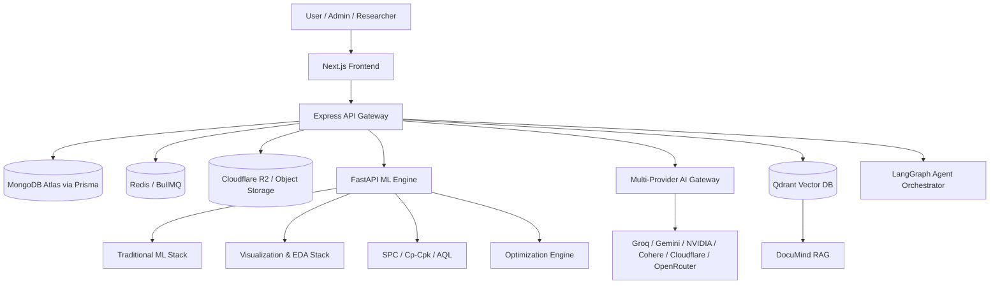

# MODLIQER AI Architecture

> **Last verified: 17/08/2026**
> **Brand: MODLIQER**
> **Tagline: Analyze data. Build models. Prove results — without code.**

MODLIQER's architecture is explicitly formalized as a **Dual-Stack AI/ML Platform** combining a Traditional Machine Learning Stack with a Generative AI & Agentic Infrastructure Layer.

---

## Dual-Stack Architecture Diagram

---

## 1. Traditional ML Stack (Predictive & Manufacturing Intelligence)
- **Data Infrastructure**: MongoDB Atlas, PostgreSQL & Supabase connectors via Prisma, Pandas/NumPy ETL.
- **Model Frameworks**: Scikit-Learn (RandomForest, GradientBoosting, ExtraTrees, LinearRegression), XGBoost (Beta), LightGBM (Beta), PyTorch MLP (Planned).
- **Hyperparameter Optimization**: Optuna Bayesian tuning pipeline (Beta) with random grid fallback.
- **Explainability**: SHAP driver analysis and feature importance ranking.
- **Serving & MLOps**: FastAPI compute engine, BullMQ background job queues, Joblib & ONNX model registry, SPC Quality Passports.

---

## 2. Generative AI & Agentic Stack (Unstructured & Autonomous Workflows)
- **Multi-Provider AI Gateway**: Backend-mediated routing across Groq, Gemini, NVIDIA, Cohere, Cloudflare, and OpenRouter.
- **Vector DB & RAG**: Qdrant vector database, DocuMind PDF document extraction with exact page citations.
- **Agent Orchestration**: State-machine execution (Agent Task Pilot), tool permission registries, and human approval gates.
- **Multimodal & Automation**: Web Speech STT/TTS Voice AI Coach, Playwright Browser AutoQA, SpendLens OCR Vision.

---

## Stack Component Status Summary

| Layer | Component | Framework / Tool | Status | Used For |
|---|---|---|---|---|
| Traditional ML | Tabular AutoML | Scikit-Learn | Implemented | Regression & Classification Leaderboards |
| Traditional ML | Gradient Boosting | XGBoost / LightGBM | Beta | Model Benchmark Comparisons |
| Traditional ML | Tuning | Optuna | Beta | Bayesian Hyperparameter Tuning |
| Traditional ML | Explainability | SHAP | Implemented | Driver Analysis & Feature Importance |
| Generative AI | LLM Gateway | Groq/Gemini/NVIDIA/Cohere/OpenRouter | Implemented | Copilots, Narratives, Report Synthesis |
| Generative AI | Vector DB | Qdrant | Beta | DocuMind PDF Search |
| Generative AI | Agent State Machines | Internal Orchestrator / LangGraph | Implemented | Agent Task Pilot & Tool Execution |
| Security | Credential Vault | MODLIQER Vault | Beta | Server-side Credential Isolation |

---

## Related Documentation
- `docs/01-architecture/LAYERED_AI_ML_STACK.md`
- `docs/04-ml-engine/TRADITIONAL_ML_STACK.md`
- `docs/06-ai/GENERATIVE_AI_STACK.md`
- `docs/06-ai/MODULAR_AI_STACK.md`
