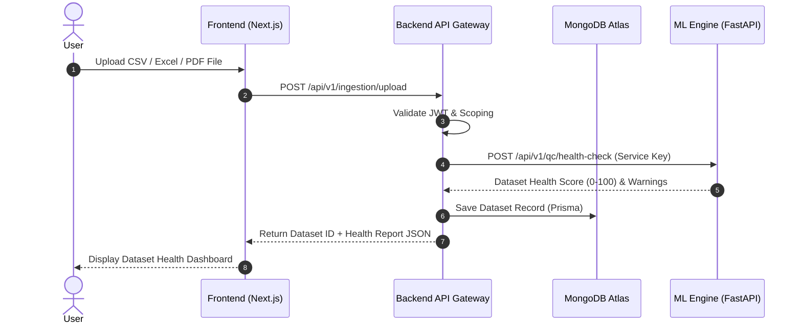
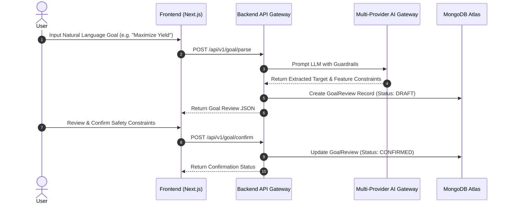
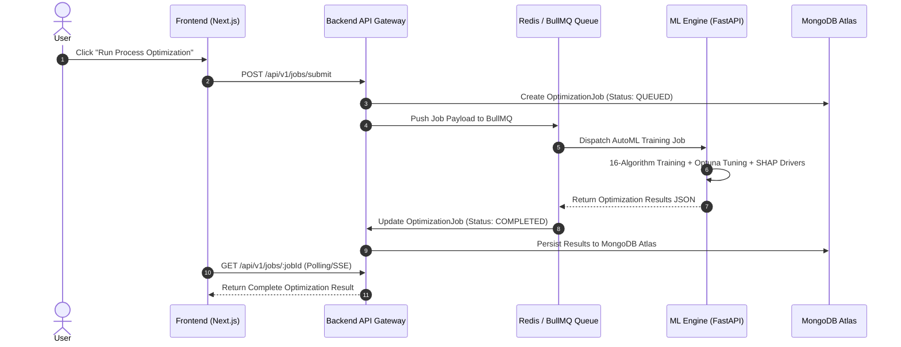
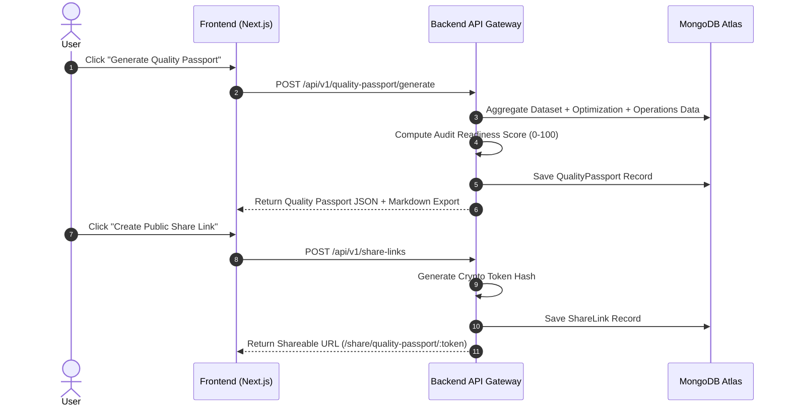

# MODLIQER Data Flow Architecture

> **Last verified:** 17/08/2026
> **Source of truth:** Current codebase inspection  
> **Status:** Implemented / Launch-Ready  

---

## 🔄 Core End-to-End Sequence Diagrams

### 1. Dataset Upload & Ingestion Flow

---

### 2. Goal Parsing & Interactive Safety Confirmation Flow

---

### 3. AutoML Optimization & Queue Flow

---

### 4. Quality Passport Generation & Public Share Link Flow

---

## 🔗 Related Documentation

- [SYSTEM_ARCHITECTURE.md](file:///c:/Users/sathish/Desktop/Modliq/Modliq/docs/01-architecture/SYSTEM_ARCHITECTURE.md) — System topology
- [QUALITY_PASSPORT.md](file:///c:/Users/sathish/Desktop/Modliq/Modliq/docs/03-backend/QUALITY_PASSPORT.md) — Backend Quality Passport specifications
