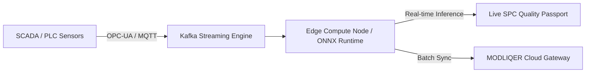

# Edge & Real-Time Inference Roadmap

> **Last verified: 17/08/2026**
> **Brand: MODLIQER**
> **Tagline: Analyze data. Build models. Prove results — without code.**

This document defines MODLIQER's architectural strategy for deploying models to edge compute nodes and streaming real-time industrial telemetry.

---

## Component Statuses

| Primitive / Technology | Status | Current Capabilities | Planned Capabilities |
|---|---|---|---|
| ONNX Export | Beta | Export Scikit-Learn models to ONNX binary format | Automated ONNX pipeline packaging |
| ONNX Runtime | Beta | CPU ONNX inference verification in Python ML Engine | Hardware-accelerated GPU/NPU inference |
| Apache Kafka Streaming | Roadmap | Batch dataset CSV ingestion | High-throughput sensor stream processing |
| Ray Serve / Triton Server | Roadmap | FastAPI single-worker serving | Distributed model serving clusters |
| TensorFlow Lite / CoreML | Roadmap | Scikit-Learn tabular models | Micro-controller & mobile device inference |
| OPC-UA / MQTT / Modbus | Roadmap | PostgreSQL / Supabase connectors | Direct SCADA & PLC historian stream binding |

---

## Edge Deployment Topology

---

## Safety & Governance Guidelines
1. Models deployed to edge nodes must carry an authenticated Quality Passport hash.
2. Edge inference endpoints are read-only and cannot alter PLC control logic without human operator confirmation.
3. Model fallback logic automatically defaults to safe deterministic setpoints if edge confidence drops below 0.85.

---

## Related Documentation
- `docs/01-architecture/LAYERED_AI_ML_STACK.md`
- `docs/08-deployment/MLOPS_AND_EDGE_ROADMAP.md`
