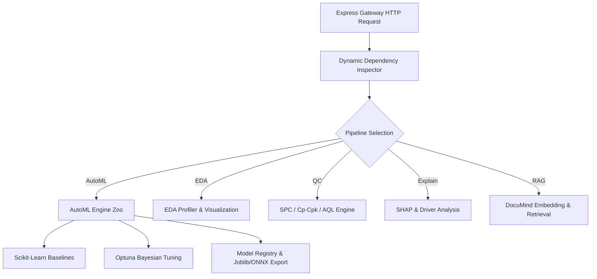

# ML Engine Architecture

> **Last verified: 17/08/2026**
> **Brand: MODLIQER**
> **Tagline: Analyze data. Build models. Prove results — without code.**

The ML Engine is a stateless FastAPI Python service dedicated to high-performance machine learning compute, exploratory data analysis, quality control statistics, and model explainability.

---

## Technical Stack Pipeline

---

## Core Pipelines & Modules
1. **AutoML Engine (`automl_engine.py`)**: Candidate model benchmarks across RandomForest, GradientBoosting, ExtraTrees, LinearRegression, plus dynamic XGBoost/LightGBM/PyTorch detection.
2. **Hyperparameter Tuning (`hyperparameter_tuning.py`)**: Optuna Bayesian search with grid/random fallback.
3. **Driver Explainability (`model_explainability.py`)**: SHAP values and tree feature importances.
4. **Model Registry (`model_registry.py`)**: Persistent ModelArtifact metadata tracking and joblib binary storage.
5. **Model Export (`model_export.py`)**: Joblib and ONNX model export.
6. **Stack Status Router (`routers/stack_status.py`)**: `GET /stack/status` endpoint.

---

## Related Documentation
- `docs/04-ml-engine/ML_ENGINE_OVERVIEW.md`
- `docs/04-ml-engine/TRADITIONAL_ML_STACK.md`
