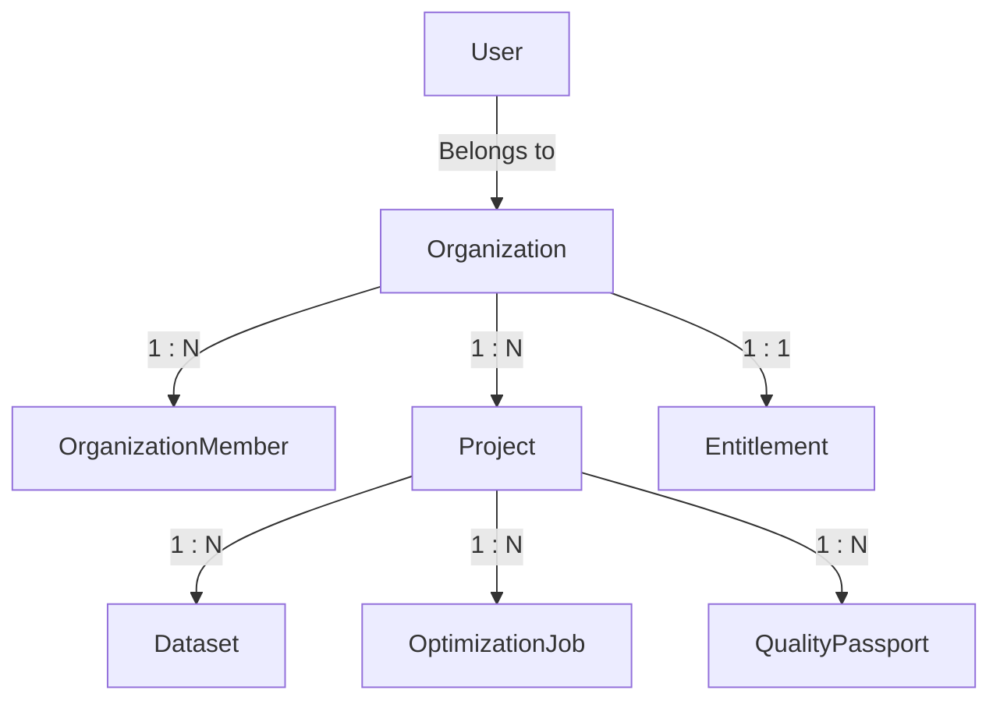

# MODLIQER Multi-Tenancy & Data Isolation Blueprint

> **Last verified:** 17/08/2026
> **Source of truth:** Current codebase inspection  
> **Status:** Implemented / Launch-Ready  

---

## 🔒 Tenant Segregation Model

MODLIQER enforces multi-tenancy at the database and application levels using strict scoped identifiers on every entity:



---

## 🔑 Key Scoping Identifiers

1. **`organizationId`**: Uniquely identifies the manufacturing company tenant. All team members, projects, datasets, and entitlements belong to a single organization.
2. **`userId`**: Identifies the individual account within an organization.
3. **`projectId`**: Isolate individual optimization studies, manufacturing lines, or product batches.
4. **`role`**: Defines organization-level RBAC privileges (`OWNER`, `ADMIN`, `MANAGER`, `ENGINEER`, `VIEWER`).

---

## 🛡️ Database Query Level Guards

All database queries executed via Prisma ORM in `backend/src/routes/` and `backend/src/services/` strictly include tenant scope clauses:

```typescript
// Example: Strict Organization & Project Scoped Query
const dataset = await prisma.dataset.findFirst({
  where: {
    id: datasetId,
    userId: req.user.id, // User isolation check
    projectId: projectId // Project boundary check
  }
});
```

Attempts to access datasets, projects, or jobs across tenant boundaries trigger an immediate HTTP `403 Forbidden` response and create an entry in `AuditLog`.

---

## 🔗 Related Documentation

- [TENANT_ISOLATION.md](file:///c:/Users/sathish/Desktop/Modliq/Modliq/docs/07-security/TENANT_ISOLATION.md) — Security mechanisms for tenant isolation
- [AUTHORIZATION.md](file:///c:/Users/sathish/Desktop/Modliq/Modliq/docs/03-backend/AUTHORIZATION.md) — RBAC middleware specifications
