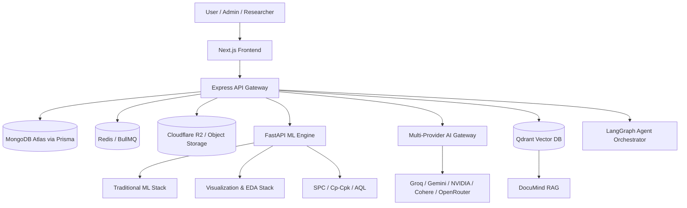

# MODLIQER System Architecture

> **Last verified: 17/08/2026**
> **Brand: MODLIQER**
> **Tagline: Analyze data. Build models. Prove results — without code.**

MODLIQER is architected as a decoupled 3-tier microservice platform built for fault isolation, high availability, and computational scalability, formalizing a **Dual-Stack AI/ML Platform**.

---

## 3-Tier Microservice Topology

---

## Core Architectural Rules

1. **Frontend Isolation**: The Next.js frontend **never** calls the database, Python ML Engine, or external AI provider APIs directly. All communications pass through the Express API Gateway.
2. **Backend API Gateway**: The Express backend is the single API gateway responsible for authentication, JWT session management, RBAC authorization, dataset persistence, and job queue orchestration.
3. **Compute-Only ML Engine**: The FastAPI ML Engine is pure compute. It operates statelessly, receiving requests authenticated with an internal `X-Modliq-Service-Key`.
4. **Primary Application Database**: **MongoDB Atlas** accessed via Prisma ORM is the single primary database for all application entities (Users, Organizations, Projects, Datasets, Quality Passports). External databases (e.g. Supabase, PostgreSQL) are supported solely as external data ingestion connectors.
5. **Background Task Queue**: Long-running AutoML jobs and data imports run asynchronously via **BullMQ** backed by **Redis**.

---

## Repository Directory Responsibilities

- `frontend/`: Next.js 15 App Router application providing public landing pages, user console, admin dashboard, and MODLIQER AI Labs UI suite.
- `backend/`: Node.js Express API server, Prisma ORM schema (`backend/src/db/prisma/schema.prisma`), BullMQ worker, and `/api/v1/ai-labs/*` routes.
- `ml-engine/`: FastAPI Python service implementing dataset profiling, AutoML model zoo, Optuna hyperparameter optimization, SHAP driver extraction, SPC quality statistics, and AI Labs micro-services (DocuMind RAG, Agent Task Pilot, Voice AI Coach, Browser AutoQA, SpendLens).

---

## Related Documentation

- `docs/01-architecture/AI_ARCHITECTURE.md` — Dual-stack AI architecture
- `docs/01-architecture/LAYERED_AI_ML_STACK.md` — 7-layer tech stack matrix
- `docs/01-architecture/SERVICE_BOUNDARIES.md` — Service responsibilities & contracts
- `docs/01-architecture/DATA_FLOW.md` — End-to-end data flow diagrams
- `docs/01-architecture/MULTI_TENANCY.md` — Tenant isolation design
- `docs/06-ai/MODULAR_AI_STACK.md` — YC-style modular AI infrastructure
