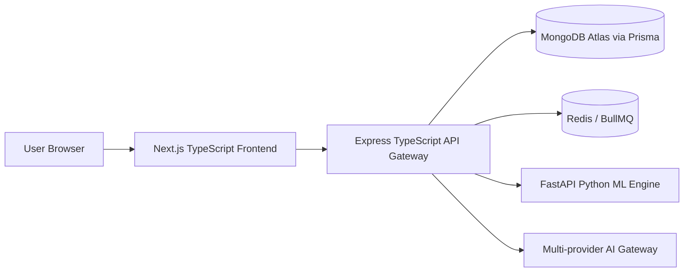

# Modliq System Architecture

> **Last verified:** 2026-08-04  
> **Source of truth:** Current codebase inspection  
> **Status:** Implemented / Launch-Ready  

---

## 🏗️ 3-Tier Microservice Topology

Modliq is architected as a decoupled 3-tier microservice platform built for fault isolation, high availability, and computational scalability.

---

## 🔍 Core Architectural Rules

1. **Frontend Isolation**: The Next.js frontend **never** calls the database, Python ML Engine, or external AI provider APIs directly. All communications pass through the Express API Gateway.
2. **Backend API Gateway**: The Express backend is the single API gateway responsible for authentication, JWT session management, RBAC authorization, dataset persistence, and job queue orchestration.
3. **Compute-Only ML Engine**: The FastAPI ML Engine is pure compute. It operates statelessly, receiving requests authenticated with an internal `X-Modliq-Service-Key`.
4. **Primary Application Database**: **MongoDB Atlas** accessed via Prisma ORM is the single primary database for all application entities (Users, Organizations, Projects, Datasets, Quality Passports). External databases (e.g. Supabase, PostgreSQL) are supported solely as external data ingestion connectors.
5. **Background Task Queue**: Long-running AutoML jobs and data imports run asynchronously via **BullMQ** backed by **Redis**.

---

## 📁 Repository Directory Responsibilities

- [`frontend/`](file:///c:/Users/sathish/Desktop/Modliq/Modliq/frontend): Next.js 15 App Router application providing public landing pages, user console, and admin dashboard.
- [`backend/`](file:///c:/Users/sathish/Desktop/Modliq/Modliq/backend): Node.js Express API server, Prisma ORM schema (`backend/src/db/prisma/schema.prisma`), and BullMQ background worker.
- [`ml-engine/`](file:///c:/Users/sathish/Desktop/Modliq/Modliq/ml-engine): FastAPI Python service implementing dataset profiling, AutoML model zoo, Optuna hyperparameter optimization, SHAP driver extraction, and SPC quality statistics.

---

## 🔗 Related Documentation

- [SERVICE_BOUNDARIES.md](file:///c:/Users/sathish/Desktop/Modliq/Modliq/docs/01-architecture/SERVICE_BOUNDARIES.md) — Service responsibilities & contracts
- [DATA_FLOW.md](file:///c:/Users/sathish/Desktop/Modliq/Modliq/docs/01-architecture/DATA_FLOW.md) — End-to-end data flow diagrams
- [MULTI_TENANCY.md](file:///c:/Users/sathish/Desktop/Modliq/Modliq/docs/01-architecture/MULTI_TENANCY.md) — Tenant isolation design
