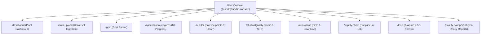

# Modliq User Console & Manufacturing Workspace Specification

> **Last updated:** 2026-08-05  
> **Status:** Implemented / Production-Ready  
> **Target Audience:** Plant Heads, Process Engineers, Quality Managers, Operations Directors, Lean Leads  
> **Positioning:** *No Data Scientist Needed · Machine Learning for Factory Teams · Modliq Calculates, AI Explains, Engineers Approve*

---

## 🏭 Executive Summary & No-Code Positioning

The **Modliq User Console** is located in `frontend/src/app/[userId]/modliq-console/` and provides plant teams with an end-to-end guided workspace to turn production data into process decisions, quality validation, and buyer-ready Quality Passports — without writing code or hiring data scientists.

### Security & User Scoping
- **User Scoping**: Scoped per user ID: `/[userId]/modliq-console/*`.
- **Middleware Guard**: `frontend/src/middleware.ts` enforces user scoping:
  - If unauthenticated $\to$ Redirect to `/login`.
  - If authenticated Admin $\to$ Redirect to `/admin`.
  - If authenticated User accessing another user's URL $\to$ Redirect to `/[session.user.id]/modliq-console/dashboard`.

---

## 🗺️ Page Hierarchy, Features & Frontend Routes

| Subpage / Module | Route | Features & Workflow Capability | Key Components |
| :--- | :--- | :--- | :--- |
| **Plant Dashboard** | `/[userId]/modliq-console/dashboard` | Workspace overview. Active dataset health score, dataset readiness shield, target analysis panel, OEE gauge widget, Pareto defect chart, and onboarding starter cards. | `SPCControlChart`, `OEEGaugeWidget`, `ParetoDefectChart`, `AiInsightCard` |
| **Universal Ingestion** | `/[userId]/modliq-console/data-upload` | Upload CSV, Excel, PDF/Word spec sheets, connect SQL/NoSQL databases (Supabase, Postgres, MongoDB), or load demo datasets. Automated column profiling & health scoring (0–100). | `DataIngestionTabs`, `DatasetHealthScorecard`, `ColumnMetadataTable` |
| **Goal Definition** | `/[userId]/modliq-console/goal` | Plain-English goal parser ("Maximize Yield above 95% while keeping Temp below 90°C"). Automatic target column detection, feature selection, and constraint bounds extraction. | `GoalParserInput`, `TargetHealthPanel`, `ConstraintEditor` |
| **Optimization Progress** | `/[userId]/modliq-console/optimization-progress` | Real-time ML model training progress monitor (parsing goal $\to$ training model $\to$ searching configurations $\to$ done). Server-sent events / polling via BullMQ backend queue. | `StageProgressRail`, `ExecutionSpinner`, `StageLogConsole` |
| **Results & Drivers** | `/[userId]/modliq-console/results` | Safe parameter setpoint windows, target improvement recommendations, SHAP feature drivers, 7-batch trial SOP step generator, and Review & Confirm wizard. | `SafeWindowsTable`, `ShapFeatureDrivers`, `ReviewConfirmWizard` |
| **Quality Studio** | `/[userId]/modliq-console/studio` | Six Sigma SPC control charts (X-bar R), process capability math ($C_p, C_{pk}$), AQL inspection sampling tables, FMEA risk calculator, and Ishikawa Fishbone root cause diagram. | `SPCControlChart`, `CpkCapabilityCard`, `FishboneDiagram`, `FMEARiskCalculator` |
| **Operations Tracker** | `/[userId]/modliq-console/operations` | Shift performance tracking, OEE gauge math (Availability × Performance × Quality), machine downtime pareto analysis, and hourly scrap logging. | `OEEGaugeWidget`, `DowntimePareto`, `ShiftLogForm` |
| **Supply Chain** | `/[userId]/modliq-console/supply-chain` | Material lot traceability, incoming vendor defect scoring, raw material batch linking, and supplier risk index. | `MaterialLotTable`, `SupplierRiskIndex`, `BatchTraceabilityCard` |
| **Lean & Kaizen Hub** | `/[userId]/modliq-console/lean` | 8-Waste event logging (Defects, Overproduction, Motion, Waiting, etc.), 5S audit scoring, and Kaizen action item Kanban board. | `WasteEventLogger`, `FiveSAuditRadar`, `KaizenKanbanBoard` |
| **Quality Passport** | `/[userId]/modliq-console/quality-passport` | Buyer-ready Quality Passport generator. Aggregates dataset readiness, $C_{pk}$ capability, optimization trial discipline, and supplier lot links into audit-ready PDF/Markdown exports and public share links. | `QualityPassportPreview`, `PassportExportModal`, `ShareLinkGenerator` |

---

## 📡 Backend APIs & Integration Endpoints

The User Console communicates with the backend Express API Gateway (`backend/src/server.ts` and `backend/src/routes/`) through Next.js proxy routes and client-side stores (`frontend/src/store/pipelineStore.ts`).

### Core Backend APIs

| Endpoint Route | Method | Purpose | Input / Output Contract |
| :--- | :--- | :--- | :--- |
| `/api/v1/auth/signup` | `POST` | User registration. Hashes password, creates `User`, default `Organization` (`OWNER`), and default `Project`. | `{ name, email, password }` $\to$ `{ token, user }` |
| `/api/v1/auth/login` | `POST` | User authentication. Returns JWT and role-based `dashboardPath`. | `{ email, password }` $\to$ `{ token, user }` |
| `/api/v1/ingestion/upload` | `POST` | Handles CSV/Excel file upload, column profiling, and health scoring. | `Multipart File` $\to$ `{ filename, analytics, healthReport }` |
| `/api/v1/optimization/parse-goal` | `POST` | NLP goal parsing into target, direction, threshold, features, and constraints. | `{ goalText, columns }` $\to$ `{ target, features, constraints }` |
| `/api/v1/optimization/jobs` | `POST` | Spawns ML optimization job in BullMQ queue. | `{ filename, template_id, intent }` $\to$ `{ jobId, status }` |
| `/api/v1/optimization/jobs/:id` | `GET` | Polls optimization job progress and results. | `jobId` $\to$ `{ stage, progress, result }` |
| `/api/v1/quality-passport/generate` | `POST` | Generates buyer-ready Quality Passport certificate & summary. | `{ userId, projectId, datasetId }` $\to$ `{ passportId, auditScore, exportedMarkdown }` |
| `/api/v1/operations/summary` | `GET` | Retrieves plant OEE math and downtime statistics. | `Bearer Token` $\to$ `{ summary: { oee, availability, performance, quality } }` |
| `/api/v1/supply-chain/lots` | `GET` | Retrieves material lot traceability records and vendor defect scores. | `Bearer Token` $\to$ `{ lots: [...] }` |

---

## ⚙️ Shared State Management (`pipelineStore.ts`)

The console state is persisted across pages using Zustand in `frontend/src/store/pipelineStore.ts`:
- `filename` & `analytics`: Active dataset metadata, row/col counts, numeric vs categorical breakdown.
- `healthReport`: Dataset health score (0–100), readiness status, warnings, and missing value counts.
- `intent`: Parsed manufacturing goal (`target`, `goal_direction`, `threshold`, `features`, `constraints`).
- `result`: Optimization output containing safe setpoint windows, recommended values, SHAP driver chart data, and 7-batch trial SOPs.

---

## 🛡️ Safety Safeguards & Human Engineer Control

1. **Review & Confirm Wizard**: Before any ML optimization recommendation is generated, Modliq presents what it understood (target, direction, variables, safety bounds) for explicit engineer confirmation.
2. **7-Batch Controlled Trial SOPs**: Process changes are never applied directly to production lines; they are presented as a step-by-step 7-batch controlled trial SOP with pre-trial checklist, operating setpoints, post-batch QC checks, and rollback triggers.
3. **Quality Passport Evidence**: Every process change is documented in a buyer-ready Quality Passport report summarizing dataset readiness, $C_{pk}$ process capability, and trial validation logs.
