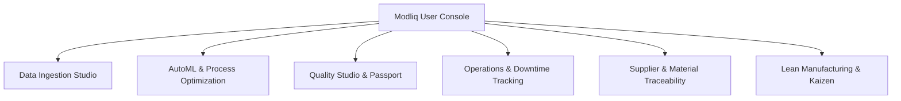

# Modliq User Console Architecture

> **Last verified:** 2026-08-04  
> **Source of truth:** Current codebase inspection  
> **Status:** Implemented / Launch-Ready  

---

## 🖥️ User Console Structure

The Modliq User Console is located in `frontend/src/app/(studio)` and `frontend/src/app/[userId]/modliq-console`. It provides a unified workspace for process engineers and plant managers.

---

## 🛠️ Console Modules & Workflow

1. **Universal Data Ingestion Studio (`/(studio)`)**: Drag-and-drop CSV/Excel files, upload PDF/Word spec sheets, connect SQL/NoSQL databases, or load demo datasets. Instant dataset health report generation (0–100 score).
2. **Goal Setup & Optimization (`/(studio)/optimization-progress`, `/(studio)/results`)**: State plain-English goals, review target variables, track real-time training progress via BullMQ/SSE, and view safe parameter windows & SHAP drivers.
3. **Quality Studio & Passport (`/[userId]/modliq-console`)**: View aggregate audit score, executive summary, SPC capability indices ($C_p, C_{pk}$), export Markdown reports, and generate public share links.
4. **Operations Tracker**: Log shift parameters, machine downtime reasons, planned vs actual runtime, scrap rates, and OEE calculations.
5. **Supply Chain Traceability**: Supplier master catalog, incoming material lot defect tracking, and batch linking.
6. **Lean & Kaizen Hub**: 8-waste event logging, 5S audit scoring, and Kaizen action item Kanban board.

---

## 🔗 Related Documentation

- [FRONTEND_OVERVIEW.md](file:///c:/Users/sathish/Desktop/Modliq/Modliq/docs/02-frontend/FRONTEND_OVERVIEW.md) — Frontend overview
- [QUALITY_PASSPORT.md](file:///c:/Users/sathish/Desktop/Modliq/Modliq/docs/03-backend/QUALITY_PASSPORT.md) — Quality Passport specs
