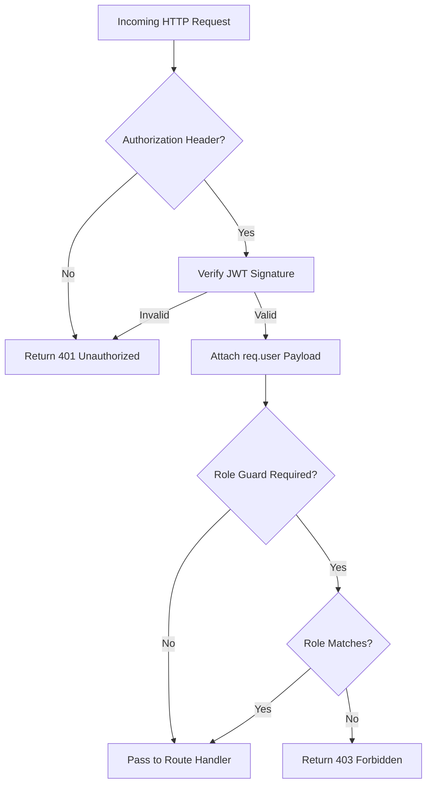

# Modliq Authentication & Authorization Specifications

> **Last verified:** 2026-08-04  
> **Source of truth:** Current codebase inspection  
> **Status:** Implemented / Launch-Ready  

---

## 🔒 Authentication Middleware Pipeline

Authentication is handled via JWT tokens issued upon login (`/api/v1/auth/login`) or NextAuth session verification. Located in `backend/src/middleware/auth.ts`.

---

## 🛡️ Helper Middleware Functions

1. **`requireAuth`**: Ensures that a valid Bearer JWT is present and populates `req.user` (`userId`, `email`, `role`, `organizationId`).
2. **`requireRole(requiredRole: string)`**: Enforces role hierarchy (e.g. `requireRole('ADMIN')` blocks regular `USER` accounts).
3. **`requireProjectAccess`**: Verifies that the authenticated user owns or belongs to the organization owning the specified `projectId`.
4. **`requireOrgRole(roles: string[])`**: Checks user's role within the target organization (`OWNER`, `ADMIN`, `MANAGER`, `ENGINEER`, `VIEWER`).

---

## 🔗 Related Documentation

- [AUTH_SECURITY.md](file:///c:/Users/sathish/Desktop/Modliq/Modliq/docs/07-security/AUTH_SECURITY.md) — Security specs
- [TENANT_ISOLATION.md](file:///c:/Users/sathish/Desktop/Modliq/Modliq/docs/07-security/TENANT_ISOLATION.md) — Multi-tenant data segregation
