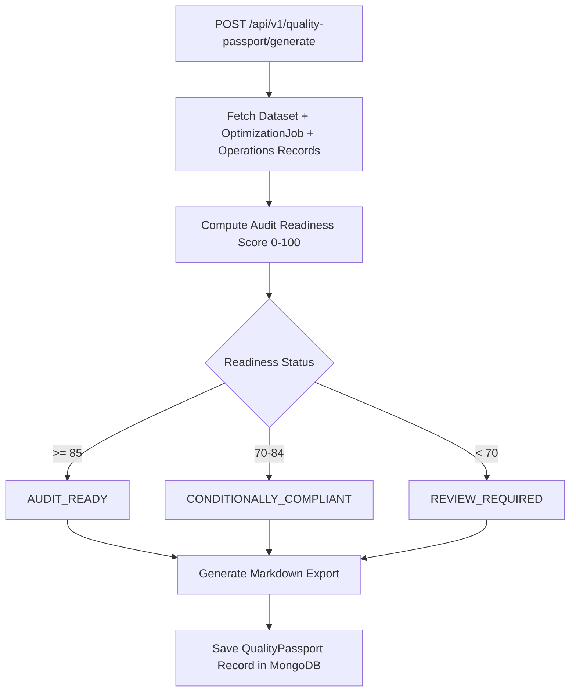

# MODLIQER Quality Passport Backend Specifications

> **Last verified:** 17/08/2026
> **Source of truth:** Current codebase inspection  
> **Status:** Implemented / Launch-Ready  

---

## 📜 Quality Passport Generation Logic

Located in `backend/src/routes/qualityPassport.routes.ts` and `backend/src/services/qualityPassport.service.ts`:

---

## 📊 Audit Readiness Status Classification

1. **`AUDIT_READY`**: High dataset health ($\ge 85$), verified optimization goal, low scrap rate ($< 2\%$).
2. **`CONDITIONALLY_COMPLIANT`**: Acceptable health ($70-84$), minor warnings present.
3. **`REVIEW_REQUIRED`**: Insufficient dataset rows, missing target bounds, or unacknowledged safety constraints.
4. **`INSUFFICIENT_DATA`**: Dataset missing required numerical parameters for SPC calculation.

---

## 🔗 Related Documentation

- [QUALITY_PASSPORT.md](file:///c:/Users/sathish/Desktop/Modliq/Modliq/docs/03-backend/QUALITY_PASSPORT.md) — Backend specifications
- [GLOSSARY.md](file:///c:/Users/sathish/Desktop/Modliq/Modliq/docs/00-overview/GLOSSARY.md) — Terms & definitions
