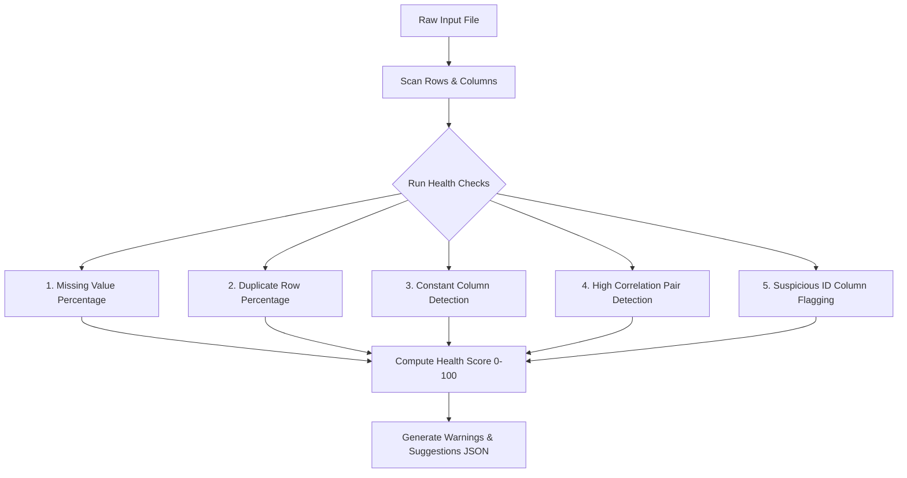

# MODLIQER Dataset Health Check Specifications

> **Last verified:** 17/08/2026
> **Source of truth:** Current codebase inspection  
> **Status:** Implemented / Launch-Ready  

---

## 🩺 Dataset Health Scoring Engine

Located in `ml-engine/routers/qc.py` (`/api/v1/qc/health-check`):

---

## 📊 Health Score Formula & Thresholds

- **Base Score**: 100 points.
- **Deductions**:
  - Missing Values $> 5\%$: -10 to -25 points depending on severity.
  - Constant Columns: -5 points per useless column.
  - High Collinear Pairs ($|r| > 0.95$): -5 points per collinear pair.
  - Duplicate Rows $> 1\%$: -10 points.
- **Classification**:
  - $\ge 85$: High Quality (Green)
  - $70-84$: Fair Quality (Amber)
  - $< 70$: Poor / Action Required (Red)

---

## 🔗 Related Documentation

- [DATASET_INGESTION.md](file:///c:/Users/sathish/Desktop/Modliq/Modliq/docs/03-backend/DATASET_INGESTION.md) — Backend ingestion rules
- [ENDPOINTS.md](file:///c:/Users/sathish/Desktop/Modliq/Modliq/docs/04-ml-engine/ENDPOINTS.md) — ML endpoints
