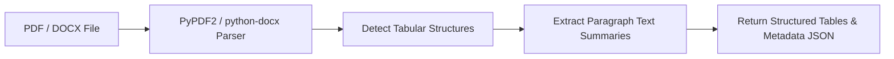

# MODLIQER PDF/Word Document Table Extractor

> **Last verified:** 17/08/2026
> **Source of truth:** Current codebase inspection  
> **Status:** Implemented / Launch-Ready  

---

## 📄 Unstructured Document Extraction

Located in `ml-engine/routers/automl.py` (`/api/v1/automl/extract-doc`):

---

## 🔬 Core Capabilities

- **PDF Table Extraction**: Scans PDF page streams for grid coordinates and tabular structures.
- **Word Document (.docx) Parsing**: Traverses DOM elements to convert Word tables into clean CSV-like dataframes.
- **Reference Document Status**: Ingested documents are stored with `status = REFERENCE_ONLY` or `TABLE_DETECTED` in `IngestedDocument`.

---

## 🔗 Related Documentation

- [DATASET_INGESTION.md](file:///c:/Users/sathish/Desktop/Modliq/Modliq/docs/03-backend/DATASET_INGESTION.md) — Ingestion APIs
- [ENDPOINTS.md](file:///c:/Users/sathish/Desktop/Modliq/Modliq/docs/04-ml-engine/ENDPOINTS.md) — ML endpoints
