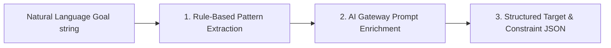

# Modliq Goal Parser Specifications

> **Last verified:** 2026-08-04  
> **Source of truth:** Current codebase inspection  
> **Status:** Implemented / Launch-Ready  

---

## 🎯 Goal Parser Engine

Located in `ml-engine/routers/goal.py` and `ml-engine/src/pipelines/goal_parser.py`:

---

## 📄 Parsing Capabilities

- **Intent Recognition**: Detects optimization direction (`MAXIMIZE`, `MINIMIZE`, `TARGET_RANGE`).
- **Target Variable Matching**: Resolves plain-English terms (e.g. *"tensile strength"*, *"yield"*, *"scrap"*) to exact column names in the uploaded dataset.
- **Variable Constraint Bounds**: Extracts hard boundaries (e.g. *"temperature between 180°C and 220°C"*).

---

## 🔗 Related Documentation

- [OPTIMIZER.md](file:///c:/Users/sathish/Desktop/Modliq/Modliq/docs/04-ml-engine/OPTIMIZER.md) — Safe parameter bounds generator
- [AI_GATEWAY.md](file:///c:/Users/sathish/Desktop/Modliq/Modliq/docs/06-ai/AI_GATEWAY.md) — AI gateway integration
