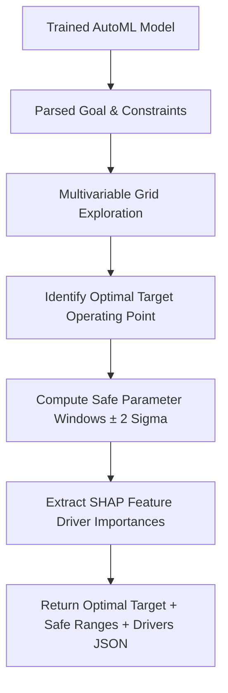

# Modliq Safe Parameter Window Optimizer

> **Last verified:** 2026-08-04  
> **Source of truth:** Current codebase inspection  
> **Status:** Implemented / Launch-Ready  

---

## ⚙️ Safe Parameter Bounds Generation

Located in `ml-engine/services/optimizer.py` and `ml-engine/src/pipelines/optimizer.py`:

---

## 📊 Output Schema & Deliverables

- **Optimal Target Value**: Expected target output (e.g. `Yield = 94.8%`).
- **Safe Parameter Windows**: Per-feature recommended operating range (e.g. `Reactor_Temp: 195.0°C – 205.0°C`).
- **SHAP Process Drivers**: Ranked key variables driving the outcome (e.g. `1. Pressure (42%), 2. Temp (31%)`).

---

## 🔗 Related Documentation

- [PIPELINES.md](file:///c:/Users/sathish/Desktop/Modliq/Modliq/docs/04-ml-engine/PIPELINES.md) — AutoML pipelines
- [GOAL_PARSER.md](file:///c:/Users/sathish/Desktop/Modliq/Modliq/docs/04-ml-engine/GOAL_PARSER.md) — Goal parser
