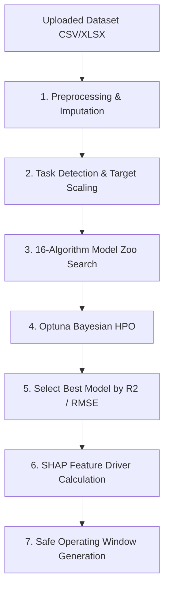

# MODLIQER AutoML & Optimization Pipelines

> **Last verified:** 17/08/2026
> **Source of truth:** Current codebase inspection  
> **Status:** Implemented / Launch-Ready  

---

## ⚡ AutoML Training & Optimization Pipeline

Located in `ml-engine/routers/automl.py` and `ml-engine/services/automl/`:

---

## 🔬 16-Algorithm Model Zoo

1. Random Forest Regressor
2. Gradient Boosting Regressor
3. XGBoost Regressor
4. LightGBM Regressor
5. Extra Trees Regressor
6. Ridge Regression
7. Lasso Regression
8. ElasticNet Regression
9. Decision Tree Regressor
10. AdaBoost Regressor
11. Support Vector Regressor (SVR)
12. K-Neighbors Regressor
13. Bayesian Ridge
14. Huber Regressor
15. SGD Regressor
16. Linear Regression

---

## 🔗 Related Documentation

- [ML_ENGINE_OVERVIEW.md](file:///c:/Users/sathish/Desktop/Modliq/Modliq/docs/04-ml-engine/ML_ENGINE_OVERVIEW.md) — ML Engine overview
- [OPTIMIZER.md](file:///c:/Users/sathish/Desktop/Modliq/Modliq/docs/04-ml-engine/OPTIMIZER.md) — Safe range optimizer
