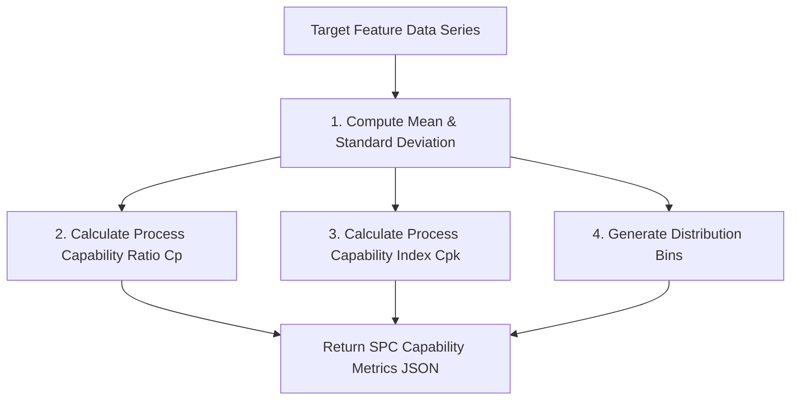

# Modliq Statistical Process Control (SPC) Engine

> **Last verified:** 2026-08-04  
> **Source of truth:** Current codebase inspection  
> **Status:** Implemented / Launch-Ready  

---

## 📊 SPC Statistical Formulas & Implementation

Located in `ml-engine/routers/qc.py` and `ml-engine/src/pipelines/qc_statistics.py`:

---

## 📐 Mathematical Definitions

- **Process Capability Ratio ($C_p$)**:
  $$C_p = \frac{\text{USL} - \text{LSL}}{6\sigma}$$
- **Process Capability Index ($C_{pk}$)**:
  $$C_{pk} = \min\left( \frac{\text{USL} - \mu}{3\sigma}, \frac{\mu - \text{LSL}}{3\sigma} \right)$$
- **Interpretation**:
  - $C_{pk} \ge 1.33$: Capable process (Green)
  - $1.0 \le C_{pk} < 1.33$: Marginally capable (Amber)
  - $C_{pk} < 1.0$: Incapable process / Defect risk (Red)

---

## 🔗 Related Documentation

- [QUALITY_PASSPORT.md](file:///c:/Users/sathish/Desktop/Modliq/Modliq/docs/03-backend/QUALITY_PASSPORT.md) — Quality Passport specs
- [GLOSSARY.md](file:///c:/Users/sathish/Desktop/Modliq/Modliq/docs/00-overview/GLOSSARY.md) — Terms & definitions
