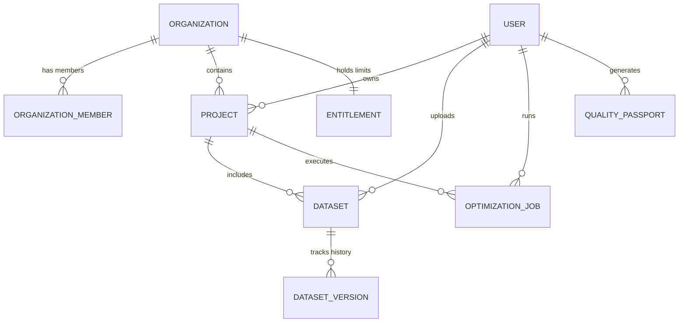

# MODLIQER Database Entity Relationships & Cascades

> **Last verified:** 17/08/2026
> **Source of truth:** Current codebase inspection  
> **Status:** Implemented / Launch-Ready  

---

## 🔗 Entity Relationship Map

---

## 🗑️ Cascade Delete Policies

Defined in `backend/src/db/prisma/schema.prisma`:
- **`User` deletion**: Cascades deletion (`onDelete: Cascade`) to `Account`, `Session`, `Dataset`, `Experiment`, `Model`, `ChatSession`, `OptimizationJob`, `OptimizationRun`, `AiConversation`, `AiMessage`, `WorkspaceState`, `Project`, `DataConnector`, `IngestedDocument`, `ImportJob`.
- **`Dataset` deletion**: Cascades deletion to `DatasetVersion`, `Experiment`, `ChatSession`.
- **`Project` deletion**: `Dataset` and `OptimizationJob` linkages are updated with `onDelete: SetNull`.

---

## 🔗 Related Documentation

- [MODELS.md](file:///c:/Users/sathish/Desktop/Modliq/Modliq/docs/05-database/MODELS.md) — Model specs
- [PRISMA_SCHEMA.md](file:///c:/Users/sathish/Desktop/Modliq/Modliq/docs/05-database/PRISMA_SCHEMA.md) — Schema definition
