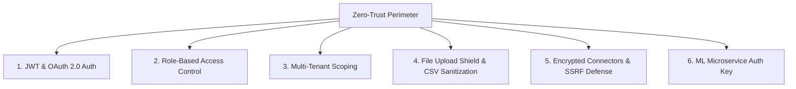

# MODLIQER Security Architecture Overview

> **Last verified:** 17/08/2026
> **Source of truth:** Current codebase inspection  
> **Status:** Implemented / Launch-Ready  

---

## 🛡️ Zero-Trust Security Design Principles

MODLIQER is built on zero-trust principles to protect proprietary manufacturing datasets, industrial process parameters, and tenant records.

---

## 🔑 Core Security Layers

1. **Secrets Management**: Absolute prohibition of hardcoded credentials. All API keys, connection strings, and JWT secrets are injected strictly via environment variables.
2. **Auth & Session Security**: Password hashing via bcrypt, signed HTTP-only JWTs, session revocation in MongoDB Atlas.
3. **Tenant Data Segregation**: Strict `organizationId`, `userId`, and `projectId` query boundaries enforced at the Prisma ORM layer.
4. **File & Formula Safety**: 50MB upload limits, MIME validation, and CSV formula injection stripping (`=`, `+`, `-`, `@`).
5. **SSRF Prevention**: Private IP range blacklisting for external database connector test endpoints.
6. **Internal Microservice Protection**: `X-MODLIQER-Service-Key` header authentication between Express backend and FastAPI ML Engine.

---

## 🔗 Related Documentation

- [SECURITY_CHECKLIST.md](file:///c:/Users/sathish/Desktop/Modliq/Modliq/docs/07-security/SECURITY_CHECKLIST.md) — Pre-launch security checklist
- [INCIDENT_RESPONSE.md](file:///c:/Users/sathish/Desktop/Modliq/Modliq/docs/07-security/INCIDENT_RESPONSE.md) — Emergency response protocol
