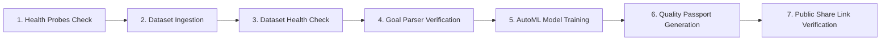

# MODLIQER End-to-End (E2E) Test Suite Documentation

> **Last verified:** 17/08/2026
> **Source of truth:** Current codebase (`frontend/playwright.config.ts` & `demo/test_e2e_platform.py`)  
> **Status:** Implemented / Deployed to Main  

---

## 🎭 Playwright E2E Test Suite (`frontend/tests/e2e/`)

MODLIQER features a multi-browser, role-aware Playwright test suite supporting Chromium, Firefox, WebKit (Safari), Mobile Chrome (Pixel 5), and Mobile Safari (iPhone 13).

```
frontend/
├── playwright.config.ts           # Multi-browser, timeout, reporter & base URL config
└── tests/e2e/
    ├── auth/
    │   ├── auth.setup.ts          # Storage state setup for Engineer & Admin personas
    │   ├── login.spec.ts          # Sign-in UI, invalid credentials, & OAuth checks
    │   └── rbac.spec.ts           # Role-Based Access Control & route protection tests
    ├── core-workflow/
    │   ├── upload.spec.ts         # Dataset ingestion & upload validation
    │   ├── goal.spec.ts           # Natural language goal parsing verification
    │   └── quality-passport.spec.ts # Quality Passport generation & public share checks
    ├── security/
    │   └── auth-gates.spec.ts     # Protected route redirect & sitemap security checks
    ├── api/
    │   └── health.spec.ts         # Backend API Gateway & ML Engine contract checks
    └── fixtures/
        ├── manufacturing_data.csv # Standard 15-row manufacturing test dataset
        ├── invalid_file.exe       # Executable file rejection test
        ├── empty.csv              # Empty file edge case fixture
        └── large_file.csv         # Async queue large dataset fixture
```

### Execution Commands

```bash
# Run complete Playwright E2E suite
cd frontend
npm run test:e2e

# Run specific suite or project
npx playwright test tests/e2e/auth
npx playwright test --project=chromium
```

---

## ⚡ Automated 7-Step Integration Test Suite (`demo/test_e2e_platform.py`)

In addition to browser-level Playwright tests, MODLIQER maintains an automated Python integration probe test suite:



### Integration Test Command

```bash
python demo/test_e2e_platform.py
```
*Current Pass Rate: 100% (7/7 steps passed).*

---

## ⚙️ CI/CD Integration

Both Playwright E2E tests and Python integration probes run automatically on GitHub Actions CI pipelines on pull requests and pushes to `main`.
