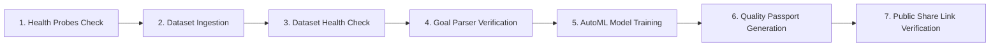

# Modliq End-to-End (E2E) Test Suite

> **Last verified:** 2026-08-04  
> **Source of truth:** Current codebase inspection (`demo/test_e2e_platform.py`)  
> **Status:** Implemented / Launch-Ready  

---

## ⚡ Automated 7-Step Integration Test Suite

Executed via `python demo/test_e2e_platform.py`:



### Verification Command
```bash
python demo/test_e2e_platform.py
```
*Current Pass Rate: 100% (7/7 steps passed).*

---

## 🔗 Related Documentation

- [TESTING_STRATEGY.md](file:///c:/Users/sathish/Desktop/Modliq/Modliq/docs/09-testing/TESTING_STRATEGY.md) — Strategy overview
- [BUILD_VERIFICATION.md](file:///c:/Users/sathish/Desktop/Modliq/Modliq/docs/09-testing/BUILD_VERIFICATION.md) — Commands
