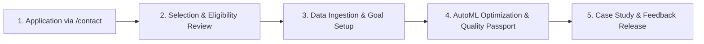

# MODLIQER Free First 10 Manufacturing Pilot Program

> **Last verified:** 17/08/2026
> **Source of truth:** Current codebase inspection  
> **Status:** Implemented / Launch-Ready  

---

## 🎯 Program Vision & Eligibility

MODLIQER is offering a **Free First 10 Manufacturing Pilot Program** for eligible manufacturing plants in India (with priority focus on Tamil Nadu industrial corridors) and globally.

### Selection Criteria
1. Operating manufacturing plant in Specialty Chemicals, Food Processing, Pharma/Nutraceuticals, Automotive Components, Packaging/Plastics, or Textiles.
2. Willingness to supply 1 anonymized historical process dataset (min 500 rows).
3. Dedicated Process Engineer or Quality Head point of contact.

---

## 🔗 Related Documentation

- [FREE_PILOT_TERMS.md](file:///c:/Users/sathish/Desktop/Modliq/Modliq/docs/10-launch/FREE_PILOT_TERMS.md) — Pilot terms
- [MARKETING_SITE.md](file:///c:/Users/sathish/Desktop/Modliq/Modliq/docs/10-launch/MARKETING_SITE.md) — Marketing site
