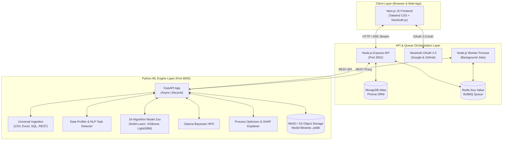

# Modliq Enterprise System Architecture & Codebase Blueprint

**Version:** 2.0.0 | **Platform:** Universal No-Code AutoML & Process Optimization Copilot  
**Maintainability Index:** Production-Grade | **Architectural Style:** Decoupled 3-Tier Microservice Topology

---

## 🏗️ 1. High-Level System Architecture Topology

The Modliq platform is built on a clean 3-tier microservice architecture designed for high scalability, fault isolation, and modular long-term maintenance.



---

## 📁 2. Directory Structure & Responsibilities

```text
Modliq/
├── frontend/                     # Next.js 15 App Router Frontend
│   ├── src/
│   │   ├── app/                  # App Router Pages & API Routes
│   │   │   ├── (studio)/         # Optimization Studio Pages
│   │   │   ├── api/              # NextAuth & AI Proxy Routes
│   │   │   ├── login/            # OAuth Sign In / Sign Up Page
│   │   │   ├── globals.css       # Modliq v2 Design System Tokens
│   │   │   └── page.tsx          # Homepage / Dashboard Entrypoint
│   │   ├── components/           # Component Library
│   │   │   ├── ui/               # MetricCard, ProgressTimeline, SHAPVisualizer, LeaderboardRow, MonitoringChart
│   │   │   ├── studio/           # PredictionForm, ProcessCopilotView
│   │   │   └── upload/           # UniversalUploader (File, SQL, REST API)
│   │   └── lib/                  # Utilities & API Clients
│   └── package.json
│
├── backend/                      # Node.js Express API & BullMQ Worker
│   ├── src/
│   │   ├── entrypoint/           # Server entrypoint (server.ts)
│   │   ├── routes/               # Modular API Routers (projects, ingestion, AI, quality)
│   │   ├── middleware/           # Auth, RBAC, Rate Limiting, Error Handlers
│   │   ├── workers/              # BullMQ Background Job Worker (jobs.worker.ts)
│   │   └── db/                   # Prisma Client & Optimization Job Helpers
│   ├── prisma/
│   │   └── schema.prisma         # MongoDB Schema Definition
│   └── package.json
│
├── ml-engine/                    # Python FastAPI AutoML & Copilot Engine
│   ├── main.py                   # FastAPI Application Entrypoint
│   ├── routers/                  # API Routers (train.py, monitor.py)
│   ├── services/                 # Domain Business Services
│   │   ├── automl/               # preprocessor.py, trainer.py, tuner.py, task_detector.py
│   │   ├── ingestion/            # data_ingestion.py, data_profiler.py
│   │   ├── storage.py            # MinIO / S3 Binary Storage (.joblib)
│   │   ├── optimizer.py          # Process Target Optimization & Safe Ranges
│   │   ├── shap_explainer.py     # SHAP Plain-English Key Process Drivers
│   │   ├── drift_detector.py     # PSI & KS Data Drift Detector + Slack Alerts
│   │   └── roi_calculator.py     # Yield Gain & Financial ROI Calculator
│   ├── schemas.py                # Pydantic Request/Response Models
│   ├── tests/                    # PyTest Unit & Integration Tests
│   └── requirements.txt
│
├── demo/                         # Demo Datasets & E2E Testing
│   ├── churn_data.csv            # Synthetic 1,000-row Dataset
│   └── test_e2e_platform.py      # Automated 7-Step E2E Integration Suite
│
├── docs/                         # System Documentation
│   ├── SYSTEM_ARCHITECTURE.md    # Architecture Blueprint (This File)
│   └── PHASE_2_IMPLEMENTATION_GUIDE.md # Phase 2 Features Guide
│
├── render.yaml                   # Production Render Multi-Service Config
├── docker-compose.yml            # Local Multi-Container Deployment
└── TODO.md                       # Roadmap & Public Launch Action Checklist
```

---

## 🛠️ 3. Modular Architectural Principles

### 1. Separation of Concerns (SoC)
- **Frontend (`frontend/`)**: Focuses 100% on UI/UX, responsive state management, and real-time visualization. It **never** executes raw database queries or direct heavy ML computation.
- **Backend API (`backend/`)**: Handles authentication, route proxying, MongoDB database persistence, and background job queuing via BullMQ.
- **ML Engine (`ml-engine/`)**: Pure, stateless computational ML engine dedicated to data profiling, model training, Bayesian tuning, inference, and SHAP explainability.

### 2. Strict Type Safety & Data Validation
- **Python**: Pydantic models (`schemas.py`) enforce strict data types on all incoming FastAPI requests.
- **TypeScript**: Shared TypeScript interfaces across Node.js backend and Next.js frontend prevent parameter mismatches.

### 3. Asynchronous Task Delegation
- Long-running model training jobs (e.g. 16-algorithm grid search) are offloaded to **BullMQ background workers** (`backend/src/workers/jobs.worker.ts`).
- Real-time training progress is streamed back to the browser via **Server-Sent Events (SSE)** (`/api/jobs/:jobId/stream`), keeping HTTP request loops responsive.

### 4. Resilient Object Storage Abstraction
- Model artifacts (`.joblib` binaries) are stored in S3-compatible **MinIO** object storage. If cloud object storage is temporarily unreachable, the system automatically falls back to local disk storage (`./model_artifacts`).

---

## 🚀 4. Production Maintenance & Scaling Playbook

### Local Development Commands
```bash
# 1. Start ML Engine (Port 8000)
cd ml-engine && python main.py

# 2. Start Backend API (Port 3001)
cd backend && npm run dev

# 3. Start Frontend App (Port 3000)
cd frontend && npm run dev

# 4. Run Automated 7-Step E2E Integration Test
python demo/test_e2e_platform.py
```

### Production Health Verification
- **ML Engine**: `GET http://localhost:8000/health`
- **Backend API**: `GET http://localhost:3001/health`
- **Frontend App**: `GET http://localhost:3000`
